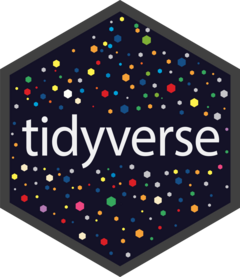

<!-- README.md is generated from README.Rmd. Please edit that file -->

```{r, include = FALSE}
knitr::opts_chunk$set(
  collapse = TRUE,
  comment = "#>",
  fig.path = "README-"
)
options(cli.hyperlink = FALSE)
```

# tidyverse <a href='https://tidyverse.tidyverse.org'></a>

<!-- badges: start -->
[](https://cran.r-project.org/package=tidyverse)
[](https://github.com/tidyverse/tidyverse/actions/workflows/R-CMD-check.yaml)
[](https://app.codecov.io/gh/tidyverse/tidyverse?branch=main)
<!-- badges: end -->

## Overview

The tidyverse is a set of packages that work in harmony because they share common data representations and API design. The __tidyverse__ package is designed to make it easy to install and load core packages from the tidyverse in a single command.

If you'd like to learn how to use the tidyverse effectively, the best place to start is [R for Data Science (2e)](https://r4ds.hadley.nz/).

## Installation

::: .pkgdown-release
```{r eval = FALSE}
# Install from CRAN
install.packages("tidyverse")
```
:::

::: .pkgdown-devel
```{r eval = FALSE}
# Install the development version from GitHub
# install.packages("pak")
pak::pak("tidyverse/tidyverse")
```
:::

If you're compiling from source, you can run `pak::pkg_system_requirements("tidyverse")`, to see the complete set of system packages needed on your machine.

## Usage

`library(tidyverse)` will load the core tidyverse packages: 

* [ggplot2](https://ggplot2.tidyverse.org), for data visualisation.
* [dplyr](https://dplyr.tidyverse.org), for data manipulation.
* [tidyr](https://tidyr.tidyverse.org), for data tidying.
* [readr](https://readr.tidyverse.org), for data import.
* [purrr](https://purrr.tidyverse.org), for functional programming.
* [tibble](https://tibble.tidyverse.org), for tibbles, a modern re-imagining of data frames.
* [stringr](https://github.com/tidyverse/stringr), for strings.
* [forcats](https://github.com/tidyverse/forcats), for factors.
* [lubridate](https://github.com/tidyverse/lubridate), for date/times.

You also get a condensed summary of conflicts with other packages you have loaded:

```{r example}
library(tidyverse)
```

You can see conflicts created later with `tidyverse_conflicts()`:

```{r conflicts}
library(MASS)
tidyverse_conflicts()
```

And you can check that all tidyverse packages are up-to-date with `tidyverse_update()`:

```{r update, eval = FALSE}
tidyverse_update()
#> The following packages are out of date:
#>  * broom (0.4.0 -> 0.4.1)
#>  * DBI   (0.4.1 -> 0.5)
#>  * Rcpp  (0.12.6 -> 0.12.7)
#>  
#> Start a clean R session then run:
#> install.packages(c("broom", "DBI", "Rcpp"))
```

## Packages

As well as the core tidyverse, installing this package also installs a selection of other packages that you're likely to use frequently, but probably not in every analysis. This includes packages for:

*   Working with specific types of vectors:

    * [hms](https://github.com/tidyverse/hms), for times.
    
*   Importing other types of data:

    * [feather](https://github.com/wesm/feather), for sharing with Python and other languages.
    * [haven](https://github.com/tidyverse/haven), for SPSS, SAS and Stata files.
    * [httr](https://github.com/r-lib/httr), for web apis.
    * [jsonlite](https://github.com/jeroen/jsonlite) for JSON.
    * [readxl](https://github.com/tidyverse/readxl), for `.xls` and `.xlsx` files.
    * [rvest](https://github.com/tidyverse/rvest), for web scraping.
    * [xml2](https://github.com/r-lib/xml2), for XML.

*   Modelling

    * [modelr](https://github.com/tidyverse/modelr), for modelling within a pipeline
    * [broom](https://github.com/tidymodels/broom), for turning models into 
      tidy data

## Code of Conduct

Please note that the tidyverse project is released with a [Contributor Code of Conduct](https://tidyverse.tidyverse.org/CODE_OF_CONDUCT.html). 
By contributing to this project, you agree to abide by its terms.
