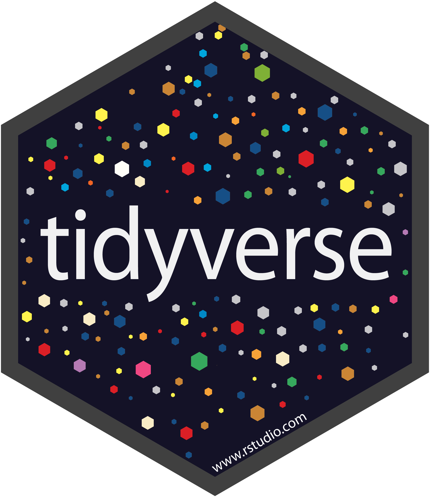

```{r, include = FALSE}
knitr::opts_chunk$set(collapse = TRUE, comment = "#>", width = 68)
options(width = 68, cli.unicode = FALSE, cli.width = 68)
```

# Summary

{ width=120px }

At a high level, the tidyverse is a language for solving data science challenges with R code. Its primary goal is to facilitate a conversation between a human and a computer about data. Less abstractly, the tidyverse is a collection of R packages that share a high-level design philosophy and low-level grammar and data structures, so that learning one package makes it easier to learn the next. 

The tidyverse encompasses the repeated tasks at the heart of every data science project: data import, tidying, manipulation, visualisation, and programming. We expect that almost every project will use multiple domain-specific packages outside of the tidyverse: our goal is to provide tooling for the most common challenges; not to solve every possible problem. Notably, the tidyverse doesn't include tools for statistical modelling or communication. These toolkits are critical for data science, but are so large that they merit separate treatment. The tidyverse package allows users to install all tidyverse packages with a single command.

There are a number of projects that are similar in scope to the tidyverse. The closest is perhaps Bioconductor [@Bioconductor; @Huber2015], which provides an ecosystem of packages that support the analysis of high-throughput genomic data. The tidyverse has similar goals to R itself, but any comparison to the R Project [@R-core] is fundamentally challenging as the tidyverse is written in R, and relies on R for its infrastructure; there is no tidyverse without R! That said, the biggest difference is in priorities: base R is highly focussed on stability, whereas the tidyverse will make breaking changes in the search for better interfaces. Another closely related project is data.table [@R-datatable], which provides tools roughly equivalent to the combination of dplyr, tidyr, tibble, and readr. data.table prioritises concision and performance.

This paper describes the tidyverse package, the components of the tidyverse, and some of the underlying design principles. This is a lot of ground to cover in a brief paper, so we focus on a 50,000-foot view showing how all the pieces fit together with copious links to more detailed resources. 

# Tidyverse package

The tidyverse is a collection of packages that can easily be installed with a single "meta"-package, which is called "tidyverse". This provides a convenient way of downloading and installing all tidyverse packages with a single R command:

```{r, eval = FALSE}
install.packages("tidyverse")
```

The core tidyverse includes the packages that you're likely to use in everyday data analyses, and these are attached when you attach the tidyverse package:

```{r}
library(tidyverse)
```

This is a convenient shortcut for attaching the core packages, produces a short report telling you which package versions you're using, and succinctly informs you of any conflicts with previously loaded packages. As of tidyverse version 1.2.0, the core packages include dplyr [@R-dplyr], forcats [@R-forcats], ggplot2 [@ggplot2], purrr [@R-purrr], readr [@R-readr], stringr [@R-stringr], tibble [@R-tibble], and tidyr [@R-tidyr]. 

Non-core packages are installed with `install.packages("tidyverse")`, but are not attached by `library(tidyverse)`. They play more specialised roles, so will be attached by the analyst as needed. The non-core packages are: blob [@R-blob], feather [@R-feather], jsonlite [@R-jsonlite], glue [@R-glue], googledrive [@R-googledrive], haven [@R-haven], hms [@R-hms], lubridate [@R-lubridate], magrittr [@R-magrittr], modelr [@R-modelr], readxl [@R-readxl], reprex [@R-reprex], rvest [@R-rvest], and xml2 [@R-xml2].

The tidyverse package is designed with an eye for teaching: `install.packages("tidyverse")` gets you a "batteries-included" set of 87 packages (at time of writing). This large set of dependencies means that it is not appropriate to use the tidyverse package within another package; instead, we recommend that package authors import only the specific packages that they use.

# Components

How do the component packages of the tidyverse fit together? We use the model of data science tools from "R for Data Science" [@r4ds]:

{ width=80% }

Every analysis starts with data __import__: if you can't get your data into R, you can't do data science on it! Data import takes data stored in a file, database, or behind a web API, and reads it into a data frame in R. Data import is supported by the core [readr](https://readr.tidyverse.org/) [@R-readr] package for tabular files (like csv, tsv, and fwf). 

Additional non-core packages, such as [readxl](https://readxl.tidyverse.org) [@R-readxl], [haven](https://haven.tidyverse.org) [@R-haven], [googledrive](https://googledrive.tidyverse.org/) [@R-googledrive], and [rvest](https://rvest.tidyverse.org/) [@R-rvest], make it possible to import data stored in other common formats or directly from the web.

Next, we recommend that you __tidy__ your data, getting it into a consistent form that makes the rest of the analysis easier. Most functions in the tidyverse work with tidy data [@tidy-data], where every column is a variable, every row is an observation, and every cell contains a single value. If your data is not already in this form (almost always!), the core [tidyr](https://tidyr.tidyverse.org/) [@R-tidyr] package provides tools to tidy it up.

```{r, include = FALSE}
# Ensure pkgdown links to the right packages.
library(dplyr)
```

Data __transformation__ is supported by the core [dplyr](https://dplyr.tidyverse.org/) [@R-dplyr] package. dplyr provides verbs that work with whole data frames, such as `mutate()` to create new variables, `filter()` to find observations matching given criteria, and `left_join()` and friends to combine multiple tables. dplyr is paired with packages that provide tools for specific column types: 

* [stringr](https://stringr.tidyverse.org) for strings.
* [forcats](https://forcats.tidyverse.org) for factors, R's categorical data 
  type.
* [lubridate](https://lubridate.tidyverse.org) [@R-lubridate] for dates and 
  date-times.
* [hms](https://hms.tidyverse.org/) [@R-hms] for clock times.

There are two main tools for understanding data: __visualisation__ and __modelling__. The tidyverse provides the [ggplot2](https://ggplot2.tidyverse.org/) [@ggplot2] package for visualisation. ggplot2 is a system for declaratively creating graphics, based on The Grammar of Graphics [@wilkinson2005].

You provide the data, tell ggplot2 how to map variables to aesthetics, what graphical primitives to use, and it takes care of the details. Modelling is outside the scope of this paper, but is part of the closely affiliated [tidymodels](https://github.com/tidymodels) [@R-tidymodels] project, which shares interface design and data structures with the tidyverse.

Finally, you'll need to communicate your results to someone else. __Communication__ is one of the most important parts of data science, but is not included within tidyverse. Instead, we expect people will use other R packages, like [rmarkdown](https://rmarkdown.rstudio.com/) [@R-rmarkdown] and [shiny](https://shiny.rstudio.com/) [@R-shiny], which support dozens of static and dynamic output formats.

Surrounding all these tools is __programming__. Programming is a cross-cutting tool that you use in every part of a data science project. Programming tools in the tidyverse include:

* [purrr](https://purrr.tidyverse.org/) [@R-purrr], which enhances R’s
  functional programming toolkit.

* [tibble](https://tibble.tidyverse.org/) [@R-tibble], which provides
  a modern re-imagining of the venerable data frame, keeping what time has
  proven to be effective, and throwing out what it has not. 

* [reprex](https://reprex.tidyverse.org/) [@R-reprex], which helps 
  programmers get help when they get stuck by easing the creation of 
  reproducible examples.

* [magrittr](https://magrittr.tidyverse.org) [@R-magrittr], which provides 
  the pipe operator, `%>%`, used throughout the tidyverse. The pipe is a tool 
  for function composition, making it easier to solve large problems by breaking 
  them into small pieces.

# Design principles

We are still working to explicitly describe the unifying principles that make the tidyverse consistent, but you can read our latest thoughts at <https://design.tidyverse.org/>. There is one particularly important principle that we want to call out here: the tidyverse is fundamentally __human centred__. That is, the tidyverse is designed to support the activities of a human data analyst, so to be effective tool builders, we must explicitly recognise and acknowledge the strengths and weaknesses of human cognition.

This is particularly important for R, because it’s a language that’s used primarily by non-programmers, and we want to make it as easy as possible for first-time and end-user programmers to learn the tidyverse. We believe deeply in the motivations that lead to the creation of S: "to turn ideas into software, quickly and faithfully" [@programming-with-data]. This means that we spend a lot of time thinking about interface design, and have recently started experimenting with [surveys](https://github.com/hadley/table-shapes) to help guide interface choices. 

Similarly, the tidyverse is not just the collection of packages --- it is also the community of people who use them. We want the tidyverse to be a diverse, inclusive, and welcoming community. We are still developing our skills in this area, but our existing approaches include active use of Twitter to [solicit feedback](https://twitter.com/hadleywickham/status/948722811232751617), announce updates, and generally listen to the community. We also keep users apprised of major upcoming changes through the [tidyverse blog](https://www.tidyverse.org/blog/), run [developer days](https://www.tidyverse.org/blog/2018/08/tidyverse-developer-day/), and support lively discussions on [RStudio community](https://community.rstudio.com).

# Acknowledgments

The tidyverse would not be possible without the immense work of the [R-core team](https://www.r-project.org/contributors.html) who maintain the R language and we are deeply indebted to them. We are also grateful for the financial support of [RStudio, Inc](https://www.rstudio.com/).

# References
